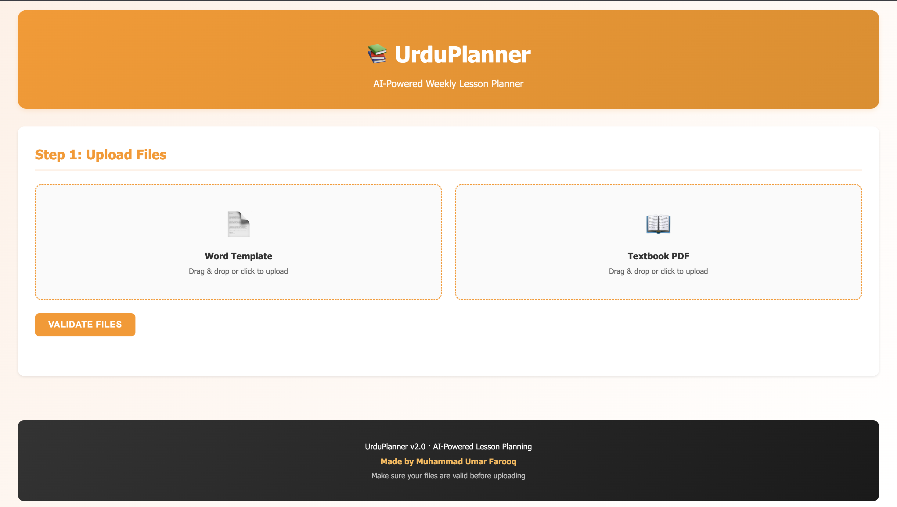
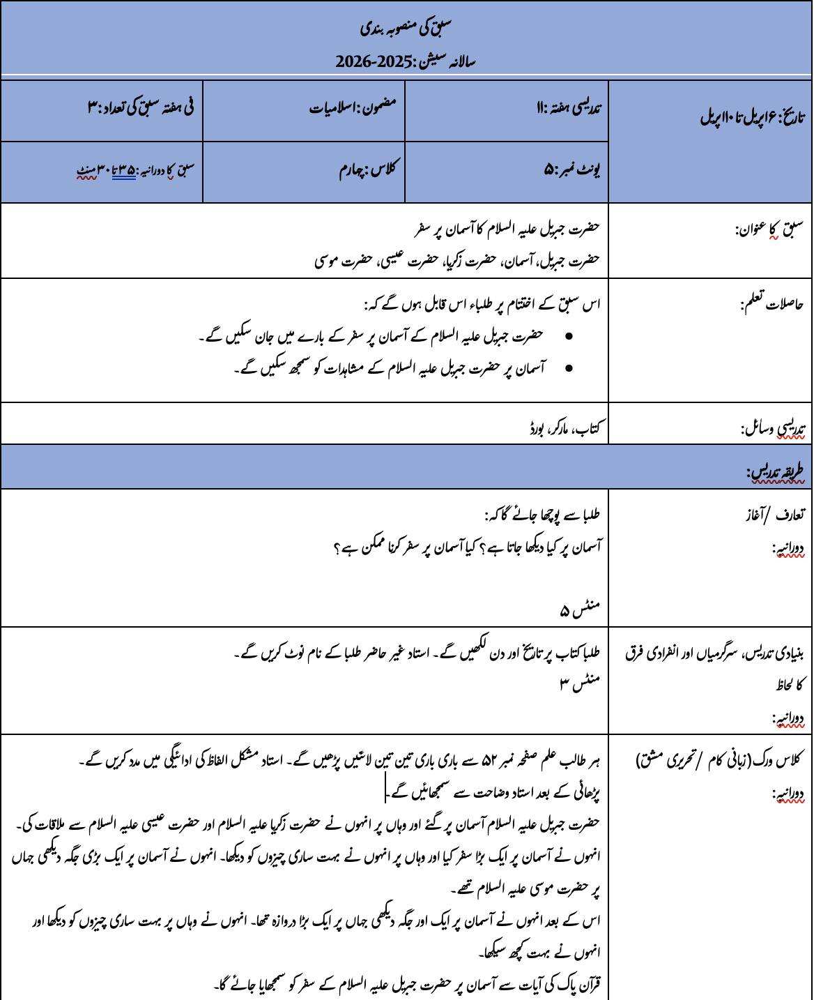

# UrduPlanner v2.0

AI-powered Urdu lesson planner that generates weekly lesson plans from textbook PDFs using LLMs. Extracts content via OCR, repairs garbled Urdu text, and fills a structured Word template via a web interface (and optional CLI).

### Features (v2.0)

- **Concurrent Processing**: Parallelizes PDF extraction, OCR repair, and LLM generation across 3 lessons for significant speedup.
- **Robust Page Range Parsing**: Supports complex page lists like `1, 3, 5-10, 15`.
- **Progress Indicators**: Live dashboard with progress bars for each lesson using `rich`.
- **Structured Logging**: Automatic audit trail for all LLM interactions and errors in the `logs/` directory.
- **Flexible Inputs**: Now includes a `Subject` prompt for multi-subject support.

### UI Output


### Generated Lesson Plan


## What It Does

- Accepts a **textbook PDF** + a **Word template** for the lesson plan layout
- **Extracts text** from PDF pages (supports both text-based and scanned/image-based PDFs via Tesseract OCR)
- **Repairs garbled OCR** — sends mangled Urdu text to the LLM for intelligent reconstruction
- **Generates 3 structured lessons** per week via LLM (Groq / LLaMA 3.3 70B), each covering a different page range
- **Fixes RTL issues** — corrects punctuation placement problems that LLMs produce with Urdu/Arabic script
- **Fills the Word template** — writes generated content into the exact table layout, preserving formatting
- Outputs a ready-to-print `.docx` planner

## Project Structure

```
UrduPlanner/
├── main.py                # CLI entry point — interactive prompts, orchestration
├── app.py                 # Web entry point — Flask API + frontend
├── config.py              # Centralized settings (.env loader)
├── requirements.txt       # Python dependencies
├── .env.example           # Environment variable template
├── .gitignore             # Git ignore rules
├── README.md              # This file
├── LICENSE                # MIT License
│
├── docs/
│   ├── QUICK_START.md     # 5-minute web setup
│   ├── FRONTEND.md        # Web frontend quick guide
│   ├── WEB_GUIDE.md       # Complete web documentation
│   ├── IMPLEMENTATION_CHECKLIST.md  # Feature checklist
│   └── workflow.md        # Detailed processing pipeline
├── templates/
│   └── index.html         # Web UI template
├── static/
│   ├── style.css          # Frontend styles
│   └── script.js          # Frontend logic
├── assets/
│   ├── ui-output.png      # Web UI screenshot
│   └── lesson-plan-sample.png  # Generated output sample
│
├── uploads/               # Temporary uploaded files (gitignored)
├── logs/                  # Runtime logs (gitignored)
├── output/                # Generated planner .docx files (gitignored)
│
├── skills/                # Core agent skills
│   ├── pdf_extractor/
│   │   ├── SKILL.md       # Agent instructions
│   │   └── pdf_extractor.py  # PDF text extraction with OCR fallback
│   ├── content_generator/
│   │   ├── SKILL.md       # Agent instructions
│   │   └── content_generator.py  # LLM-powered OCR repair + lesson generation
│   ├── rtl_fixer/
│   │   ├── SKILL.md       # Agent instructions
│   │   └── rtl_fixer.py   # RTL punctuation fixes for Urdu text
│   ├── template_engine/
│   │   ├── SKILL.md       # Agent instructions
│   │   └── template_engine.py  # Word template parser and filler
```

## Prerequisites

- **Python 3.10+**
- **Tesseract OCR** with Urdu language pack (for scanned PDFs)
- **Groq API key** (free tier available at [console.groq.com](https://console.groq.com))

### Installing Tesseract (macOS)

```bash
brew install tesseract
brew install tesseract-lang   # includes Urdu language data
```

## Quick Start

```bash
# 1. Install dependencies in this environment
python -m pip install -r requirements.txt

# 2. Set up your API key
cp .env.example .env
# Edit .env and add your GROQ_API_KEY

# 3. Place your files
#    - template.docx  → Word template with the lesson plan table layout
#    - textbook.pdf   → The Urdu textbook to extract content from

# 4. Run
python main.py
```

For web mode, run:

```bash
python app.py
# Open http://127.0.0.1:5001
```

The program asks all questions interactively — no command-line arguments needed:

```
→ Week number?          (e.g. 8)
→ Date range?           (e.g. 9 March to 13 March)
→ Pages?                (e.g. 1-5, 12, 15-20)
→ Subject?              (e.g. Islamiyat)
```

## Configuration

All settings are in `.env` (see `.env.example`):

| Variable | Default | Description |
|----------|---------|-------------|
| `GROQ_API_KEY` | — | Your Groq API key |
| `MODEL` | `llama-3.3-70b-versatile` | LLM model to use |
| `TEMPERATURE` | `0.3` | LLM temperature for generation |
| `MAX_UPLOAD_MB` | `300` | Maximum combined upload payload size accepted by web API |
| `OUTPUT_DIR` | `output` | Directory for generated planners |
| `LOG_DIR` | `logs` | Directory for log files |

## Output

Generates a `.docx` file in `output/` named like:

```
Planner_Week_8_p99-108.docx
```

The file contains the filled lesson plan template with 3 lessons, each covering a subset of the specified pages.

## Tech Stack

- **LLM**: Groq API → LLaMA 3.3 70B Versatile (128K context)
- **PDF Extraction**: PyMuPDF (text layer) + Tesseract OCR (scanned pages)
- **Template**: python-docx (Word document manipulation)
- **Web UI**: Flask + HTML/CSS/JS frontend
- **CLI UX**: Rich (interactive prompts and styled panels)
- **RTL Handling**: Custom regex-based fixer for Urdu punctuation

## Limitations

This tool is an **assistant, not a replacement** for human teachers. The LLM-generated content may contain:

- Inaccurate retelling of textbook content (hallucinated details or missed points)
- Incorrect Urdu grammar or awkward phrasing
- Wrong page number references
- Occasional formatting issues in the filled Word template

**Human review is required** before using any generated planner in a classroom. Always verify the content against the original textbook.

## Author

Muhammad Umar Farooq — [GitHub](https://github.com/omerfarooq223)
