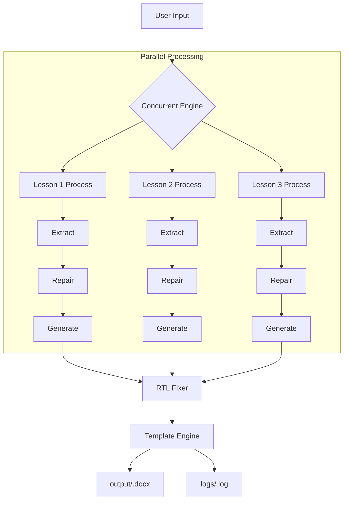

# My Work Description — UrduPlanner Workflow (v2.0)

## Overview

This document describes the end-to-end workflow of the UrduPlanner v2.0, which uses concurrent processing to generate lesson plans efficiently.

---

## Pipeline Steps

### Step 1: Configuration Loading
- On startup, `config.py` reads the `.env` file via `python-dotenv`.
- Settings loaded: `GROQ_API_KEY`, `MODEL`, `TEMPERATURE`, `OUTPUT_DIR`, `LOG_DIR`.
- All LLM calls use the centralized model and temperature settings.
- **[NEW]** Log directory is initialized for audit trails.

### Step 2: User Input (Interactive CLI)
- The user is prompted for values via Rich-styled prompts:
  1. **Week number** — e.g. `8`
  2. **Date range** — e.g. `9 March to 13 March`
  3. **Page range** — **[ROBUST]** Supports lists like `1, 3, 5-10`.
  4. **Subject** — **[NEW]** e.g. `Islamiyat` or `Urdu`.
- The page list is parsed into unique sorted integers.
- The list is split into 3 groups (one per lesson) as evenly as possible.

### Step 3: Template Reading
- `skills/template_engine/template_engine.py` loads the Word template (`template.docx`) using `python-docx`.
- `get_template_structure()` extracts the layout of table 0 as a sample for the LLM.

### Step 4-6: Concurrent Lesson Processing
- **[NEW]** The following steps are now performed in parallel using `ThreadPoolExecutor` (3 workers):

#### 4.1: PDF Text Extraction
- `skills/pdf_extractor/pdf_extractor.py` extracts text for each lesson's specific page range.
- Uses PyMuPDF for text layers and Tesseract OCR for scanned pages.

#### 4.2: OCR Text Repair
- Raw extracted text is sent to the LLM (Groq) for intelligent reconstruction.
- Fixes mangled words and removes noise while preserving structure.

#### 4.3: Lesson Content Generation
- The LLM generates a JSON object for the lesson based on the cleaned textbook content and template sample.
- **[NEW]** Structured logging records the start and success/failure of each generation task.

### Step 7: RTL Text Fixing & Polishing
- Post-processes output to:
  1. Strip foreign characters.
  2. Fix RTL colon placement (ensuring colons are correctly positioned in Urdu script).

### Step 8: Template Filling
- Maps the generated JSON fields to the Word document tables.
- Preserves formatting (font, size, RTL direction).
- Fills all 3 tables before saving.

### Step 9: Output & Logging
- The document is saved to `output/`.
- A detailed log of the session is saved to `logs/`.

---

## Error Handling

| Scenario | Handling |
|----------|----------|
| Missing files/API key | Error message, program exits |
| Invalid page syntax | Robustly ignored or error message if empty |
| PDF out of bounds | Validated using PyMuPDF before processing |
| LLM Task Failure | Logged to file, error shown in CLI, other tasks continue |
| Template mismatch | `ValueError` if lessons > tables |

---

## Data Flow Diagram (v2.0)

